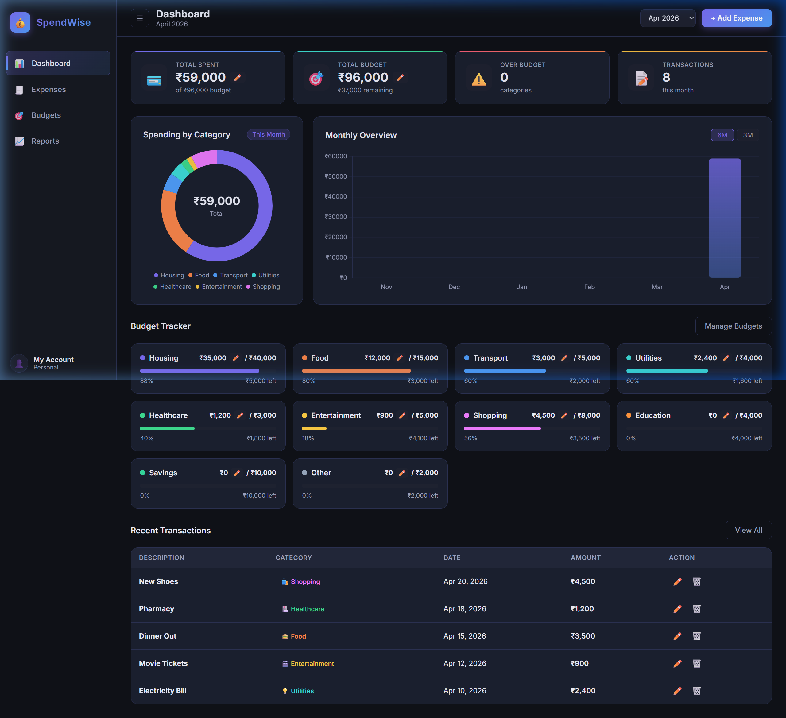
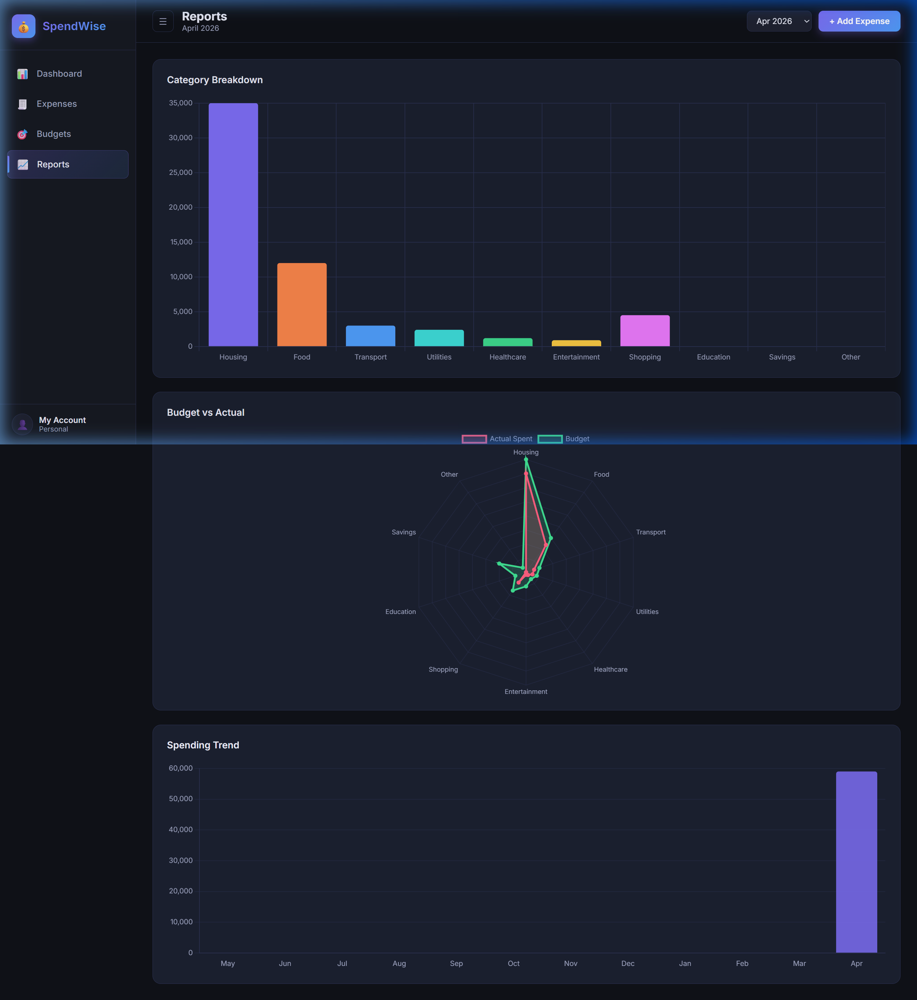

# 💰 SpendWise — Premium Expense Dashboard

SpendWise is a sleek, premium dark-themed single-page application designed to help you master your personal finances. With a modern glassmorphism aesthetic and interactive data visualization, tracking your home expenses has never looked this good.

---

## ✨ Key Features

- **🎨 Premium Dark Mode UI**: A meticulously crafted interface with glassmorphism effects, vibrant accents, and smooth transitions.
- **📊 Interactive Dashboards**: Visualize your spending patterns with dynamic donut charts, bar graphs, and radar charts powered by **Chart.js**.
- **🎯 Budget Management**: Set monthly limits for 10+ categories and track your progress with real-time visual bars.
- **📝 Detailed Logging**: Effortlessly log expenses with descriptions, amounts (in ₹), categories, and dates.
- **🔐 Privacy First**: Your data stays yours. Everything is stored locally in your browser's `localStorage`—no servers, no tracking.
- **📱 Fully Responsive**: Optimized for both desktop and mobile viewing.

---

## 🛠️ Tech Stack

SpendWise is built using modern web standards for maximum performance and zero dependencies (excluding Chart.js).

| Technology | Purpose |
| :--- | :--- |
|  **HTML5** | Semantic structure and layout |
|  **Vanilla CSS** | Glassmorphism design and custom variables |
|  **JavaScript** | State management and interactive logic |
|  **Chart.js** | Advanced data visualization |

---

## 🚀 Getting Started

Since SpendWise uses `localStorage` and complex JavaScript, it is recommended to run it through a local server to ensure all features work correctly.

### Option 1: VS Code (Easiest)
1. Install the **Live Server** extension.
2. Right-click on `index.html` and select **"Open with Live Server"**.

### Option 2: Python
1. Open your terminal in the project folder.
2. Run: `python -m http.server 8000`
3. Navigate to `http://localhost:8000` in your browser.

---

## 📸 Screenshots

| Dashboard Overview | Reports & Analytics |
| :---: | :---: |
|  |  |

---

## 🤝 Contributing

Contributions are welcome! If you have ideas for new features or UI improvements, feel free to fork the repo and submit a PR.

1. Fork the Project
2. Create your Feature Branch (`git checkout -b feature/AmazingFeature`)
3. Commit your Changes (`git commit -m 'Add some AmazingFeature'`)
4. Push to the Branch (`git push origin feature/AmazingFeature`)
5. Open a Pull Request

---

## 📄 License

Distributed under the MIT License. See `LICENSE` for more information.

---

  Developed with ❤️ by <a href="https://github.com/Daksh-cpu">Daksh-cpu</a>

